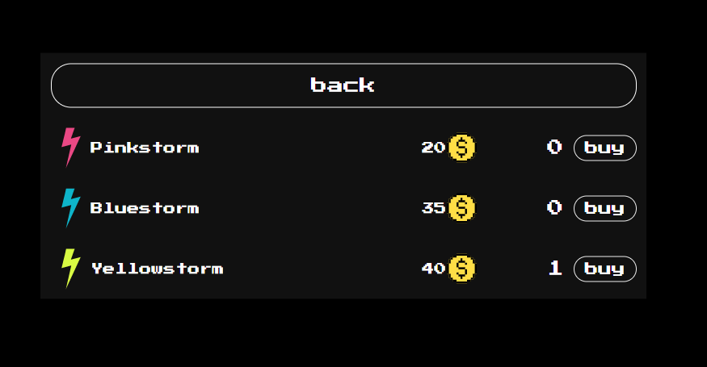
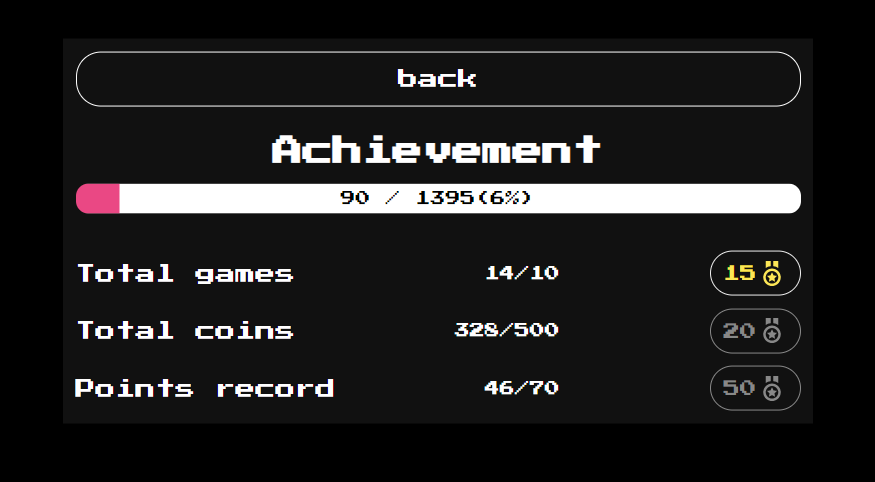
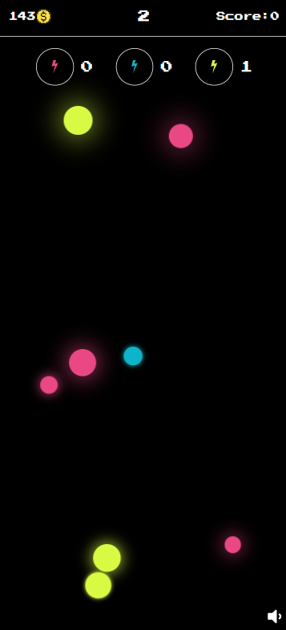

<h1 align="center">Clickstorm</h1>
<h2 align="center"><a  href="https://clickstorm.netlify.app/">Live Version</a></h2>

## Description
Clickstorm is a retro game. Implemented in React (Redux Toolkit). This is the starting version, all updates will be described here.
<p align="center"></p>

## Opportunities

 ### Skills
  - Pinkstorm
  - Bluestorm
  - Yellowstorm

 ### Store
 While the choice is not great.
 <p align="center"></p>
 
 ### Achievement
 I know they are easy, but each achievement has its own levels.
 <p align="center"></p>
 
 ## Mobile version
 
 <p align="center"></p>
 
 ## Project setup

```
npm install
npm start
```
